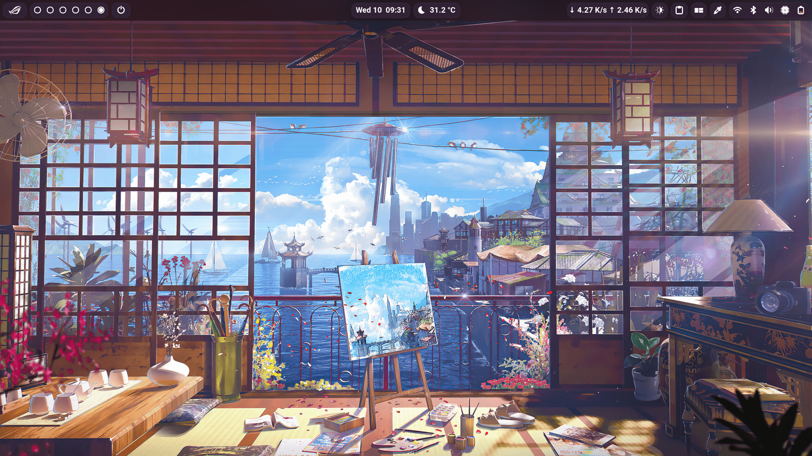

# Dotfiles

My personal configs for macOS, Linux and Windows, managed with [Dotter](https://github.com/SuperCuber/dotter).



## What's inside

Configs are grouped by tool. [Dotter](https://github.com/SuperCuber/dotter) symlinks
each one into place based on a per-OS profile, so the same repo drives macOS, Linux
and Windows.

- **Shells & terminals:** Bash, Zsh, Fish, NuShell, Ghostty, Kitty
- **Editors:** Neovim, Helix, VSCode. _Neovim configs shamelessly stolen from [Blonteractor](https://github.com/blonteractor/nvim-config) 😼_
- **Keyboard:** Karabiner-Elements (macOS), keyd (Linux)
- **macOS automation:** Hammerspoon (menu-bar Spaces + window tricks)
- **Tooling & misc:** Git, Starship, Atuin, Neofetch, Tmux
- **Desktop:** Grub, GNOME Shell (not managed by Dotter; see the [gnome-shell configs](https://github.com/legitShivam/gnome-shell-configs/blob/main/README.md))
- **Hardware profiles:** [system-profiles](system-profiles/README.md) (syncs USB autosuspend, GPU clocks and lid behavior with GNOME Power Mode)

## Install

The quickest path on a fresh Linux box is the bootstrap script, which pulls the
repo and deploys everything for you:

```bash
# Linux one-liner
curl https://raw.githubusercontent.com/vyogami/dotfiles/main/linux-install.sh | sh
```

On macOS or Windows (or if you'd rather do it by hand), use the manual steps below.

<details>
<summary>Manual install (all platforms)</summary>

<br>

1. Clone (needs [Dotter](https://github.com/SuperCuber/dotter) installed):

     ```bash
     git clone --recursive https://github.com/vyogami/dotfiles.git && cd dotfiles
     ```

2. Pick your OS profile (`linux` / `macos` / `windows`) and deploy:

     ```bash
     cp .dotter/<os>.toml .dotter/local.toml
     ./dotter deploy        # ./dotter.arm (Unix arm) | ./dotter.exe (Windows)
     ```

     > Safe to re-run; add `-f` to overwrite existing files.

</details>

<details>
<summary>macOS extras (Karabiner + Hammerspoon)</summary>

<br>

The `macos` profile manages `ghostty`, `karabiner` and `hammerspoon`.

1. **Karabiner** loads `karabiner.json` automatically; no build step.
2. **Hammerspoon** needs its space-switch helper compiled once (binary is git-ignored):

     ```bash
     ./hammerspoon/build.sh   # -> ~/.hammerspoon/bin/spaceswitch (needs Xcode CLT)
     ```

3. Grant Hammerspoon **Accessibility**, and enable *Move left/right a space* under
   System Settings → Keyboard → Keyboard Shortcuts → Mission Control.

Hammerspoon is split into independent modules under `hammerspoon/modules`. Toggle
any feature with the `features` flags at the top of `hammerspoon/init.lua`
(scroll-to-switch-Spaces, click-for-Mission-Control, Cmd+Tab monitor focus);
turning one off never affects the others.

</details>

## Keybindings

Most of my muscle memory lives in the keyboard remaps. Karabiner covers macOS,
keyd mirrors the important bits on Linux, and Hammerspoon adds window and Spaces
automation on top. Expand a section for the full mapping.

<details>
<summary>Karabiner (macOS)</summary>

| Keys | Action |
| --- | --- |
| <kbd>Space</kbd> (hold) + <kbd>h</kbd>/<kbd>j</kbd>/<kbd>i</kbd>/<kbd>k</kbd>/<kbd>l</kbd>/<kbd>;</kbd> … | vim-style arrow motion layer |
| <kbd>Caps Lock</kbd> (tap / hold) | <kbd>Esc</kbd> / <kbd>Ctrl</kbd> |
| <kbd>Esc</kbd> | <kbd>Caps Lock</kbd> |
| <kbd>⌥</kbd> tapped alone | Mission Control |
| <kbd>Ctrl</kbd> + <kbd>V</kbd> | <kbd>⌘</kbd> + <kbd>V</kbd> (paste) everywhere |
| <kbd>Ctrl</kbd> + <kbd>C</kbd> | <kbd>⌘</kbd> + <kbd>C</kbd> (copy) everywhere except terminals and IDEs |
| Zen: <kbd>Ctrl</kbd> + <kbd>T</kbd>/<kbd>F</kbd>/<kbd>W</kbd>/<kbd>L</kbd>/<kbd>R</kbd>/<kbd>S</kbd>/<kbd>C</kbd>/<kbd>X</kbd>/<kbd>Z</kbd>/<kbd>1</kbd> to <kbd>0</kbd>/<kbd>-</kbd>/<kbd>=</kbd>/<kbd>,</kbd> | <kbd>⌘</kbd> + equivalent (<kbd>Ctrl</kbd> + <kbd>Tab</kbd> & <kbd>Ctrl</kbd> + <kbd>Alt</kbd> + \* preserved) |
| External Redgear keyboard | Swaps left <kbd>⌘</kbd>/<kbd>⌥</kbd>, maps left <kbd>Ctrl</kbd> → <kbd>⌘</kbd> |
</details>

<details>
<summary>Hammerspoon (macOS)</summary>

| Input | Action |
| --- | --- |
| Scroll over the menu bar | Switch Spaces (up = prev, down = next) |
| Click empty menu-bar area | Toggle Mission Control (active screen only) |
| <kbd>⌘</kbd> + <kbd>Tab</kbd> | Focus (and move cursor to) the frontmost window on the next monitor |
</details>

<details>
<summary>keyd (Linux)</summary>

| Keys | Action |
| --- | --- |
| <kbd>Space</kbd> (tap / hold) | <kbd>Space</kbd> / arrow layer |
| <kbd>Caps Lock</kbd> (tap / hold) | <kbd>Esc</kbd> / <kbd>Ctrl</kbd> |
| <kbd>Esc</kbd> | <kbd>Caps Lock</kbd> |
| <kbd>Right Alt</kbd> ⇄ <kbd>Right Ctrl</kbd> | Swapped |

Arrow layer (hold <kbd>Space</kbd>): <kbd>j</kbd>/<kbd>i</kbd>/<kbd>k</kbd>/<kbd>l</kbd> → arrows · <kbd>h</kbd>/<kbd>;</kbd> → Home/End · <kbd>u</kbd>/<kbd>d</kbd> → PgUp/PgDn · <kbd>m</kbd>/<kbd>n</kbd> → Delete/Backspace
</details>

## Contributing

These are my configs. Use them as it is or stitch bits together into your own unholy creation 😉 

## License

[Unlicense](LICENSE). Do whatever you want.
